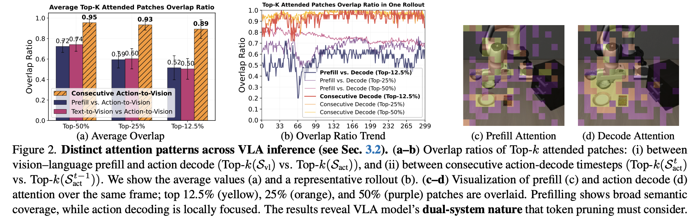
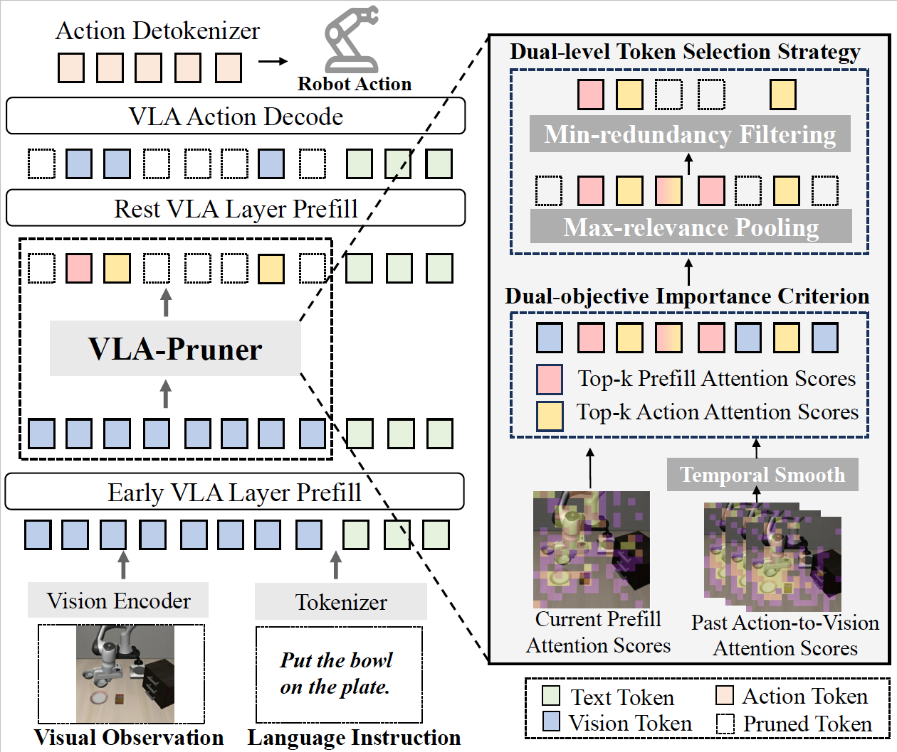

# <div align="center">VLA-Pruner: Temporal-Aware Dual-Level Visual Token Pruning for Efficient Vision-Language-Action Inference</div>

<div align="center">

[](https://arxiv.org/pdf/2511.16449v3)
[](LICENSE)

**Ziyan Liu, Yeqiu Chen, Hongyi Cai, Tao Lin, Shuo Yang, Zheng Liu, Bo Zhao**

</div>

<div align="center">
  <strong>🔥 VLA-Pruner is a training-free, plug-and-play solution for accelerating vision-language-action models via temporal-aware dual-level visual token pruning.</strong>
</div>

---

## 📌 News

🔥 **[2025/02/06]**: Code for OpenVLA is available ([OpenVLA README](src/openvla/README_VLA_Pruner.md)).

---

## 🎯 Overview

We identify the dual-system nature in VLA models with distinct attention patterns: prefilling shows broad semantic coverage, while action decoding is locally focused.

<p align='center'>

</p>

Based on this observation, VLA-Pruner accelerates VLA inference by pruning redundant visual tokens using temporal-aware dual-level selection, achieving significant speed-up with minimal accuracy loss.

<p align='center'>

</p>

---

## 🛠️ Installation

### 1. Clone the repository
```bash
git clone https://github.com/MINT-SJTU/VLA-Pruner.git
cd VLA-Pruner
```

### 2. Set up environments
Follow the [OpenVLA](src/openvla/README.md) setup instructions.

```bash
conda activate openvla
cd src/openvla
pip install -e .
```

---

## 🚀 VLA-Pruner Evaluation

### 🔧 OpenVLA Evaluation

#### ✅ Download pretrained checkpoint:
```bash
conda activate openvla
cd src/openvla
python vla_pruner_srcipts/download_model_local.py \
  --model_id openvla/openvla-7b-finetuned-libero-spatial
```

#### ▶️ Run evaluation with VLA-Pruner:
```bash
CUDA_VISIBLE_DEVICES=0 python experiments/robot/libero/run_libero_eval.py \
    --pretrained_checkpoint checkpoints/openvla-7b-finetuned-libero-spatial \
    --task_suite_name libero_spatial \
    --use_fastv True \
    --use_prefil_attention True \
    --use_temporal True \
    --fastv_r 0.75 \
    --num_trials_per_task 50
```

#### ⚡ Run evaluation with FastV:
```bash
CUDA_VISIBLE_DEVICES=0 python experiments/robot/libero/run_libero_eval.py \
    --pretrained_checkpoint checkpoints/openvla-7b-finetuned-libero-spatial \
    --task_suite_name libero_spatial \
    --use_fastv True \
    --use_temporal False \
    --fastv_r 0.75 \
    --num_trials_per_task 50
```

#### Run OpenVLA baseline (without VLA-Pruner):
```bash
CUDA_VISIBLE_DEVICES=0 python experiments/robot/libero/run_libero_eval.py \
    --pretrained_checkpoint checkpoints/openvla-7b-finetuned-libero-spatial \
    --task_suite_name libero_spatial \
    --use_fastv False \
    --num_trials_per_task 50
```

For more evaluation scripts and detailed instructions, see [OpenVLA README](src/openvla/README_VLA_Pruner.md).

---

## 📖 Citation

If you find this work useful, please cite:
```bibtex
@article{liu2025vla,
  title={VLA-Pruner: Temporal-Aware Dual-Level Visual Token Pruning for Efficient Vision-Language-Action Inference},
  author={Liu, Ziyan and Chen, Yeqiu and Cai, Hongyi and Lin, Tao and Yang, Shuo and Liu, Zheng and Zhao, Bo},
  journal={arXiv preprint arXiv:2511.16449},
  year={2025}
}
```

---

## 🤝 Acknowledgements

We build on the amazing work of [OpenVLA](https://github.com/openvla/openvla) and [Huggingface Transformers](https://github.com/huggingface/transformers).

---

## 📜 License

This project is licensed under the [MIT License](LICENSE).
