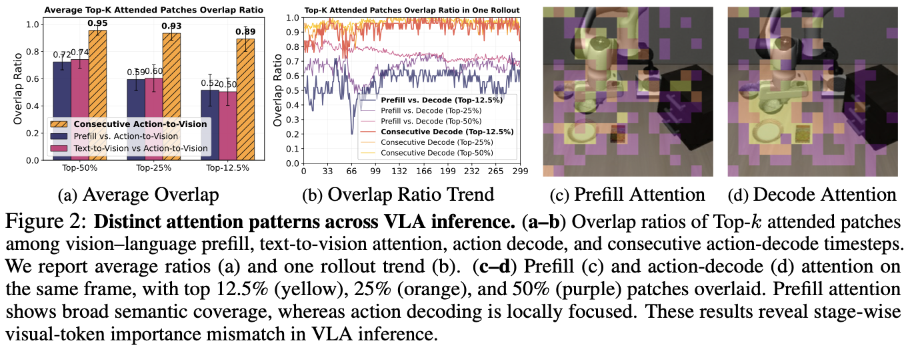
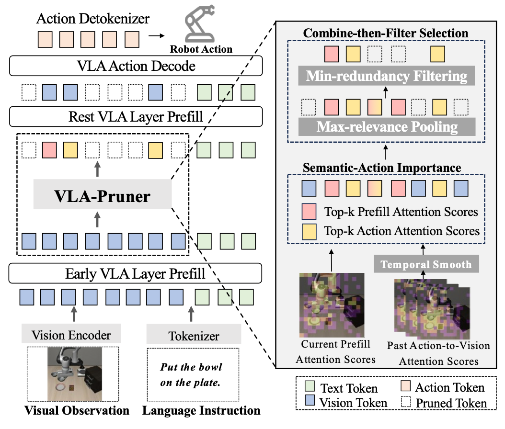

# <div align="center">Bridging the Semantic-Action Gap in Visual Token Pruning for Efficient VLA Inference (VLA-Pruner)</div>

<div align="center">

[](https://arxiv.org/pdf/2511.16449v5)
[](LICENSE)

**Ziyan Liu, Yeqiu Chen, Yiming Zhang, Hongyi Cai, Tao Lin, Runquan Gui, Shuo Yang, Zheng Liu, Bo Zhao**

</div>

<div align="center">
VLA-Pruner is a training-free, plug-and-play visual token pruning method for efficient VLA inference. It bridges the semantic-action gap by combining semantic importance from vision-language prefilling with temporally smoothed action relevance from recent action decoding.
</div>

---

## 📌 News

🔥 **[2025/02/06]**: Code for OpenVLA is available ([OpenVLA README](src/openvla/README_VLA_Pruner.md)).

🔥 **[2026/05/25]**: Code for OpenVLA-OFT is available ([OpenVLA-OFT README](src/openvla-oft/README_VLA_Pruner.md)).

📝 **[2026/05/26]**: The latest revision of our paper is available ([v0.2](https://arxiv.org/abs/2511.16449v5)); see the previous version here ([v0.1](https://arxiv.org/abs/2511.16449v3)).

---

## 🎯 Overview

Vision-Language-Action (VLA) models integrate visual perception, language understanding, and action execution, but their real-time deployment requires processing continuous visual streams, leading to substantial computational overhead. Visual token pruning, which has been widely used to accelerate VLMs, offers a natural solution by retaining salient tokens and discarding redundant ones. However, directly applying VLM-oriented pruning methods to VLA inference can severely degrade manipulation performance.

Our analysis attributes this degradation to a key mismatch between semantic salience and action relevance. VLA inference exhibits distinct attention patterns between the vision-language prefill stage and the action-decode stage. Pruning based only on context-prefill semantic salience is therefore biased toward semantic cues and may remove action-critical visual tokens. The following observation illustrates this semantic-action mismatch across inference stages.

<p align='center'>

<br>
<em>Observation: semantic salience during prefilling does not fully align with action relevance during decoding.</em>
</p>

To address this issue, we propose VLA-Pruner, an effective plug-and-play token pruning method tailored to the visual requirements of VLA inference. VLA-Pruner estimates visual-token importance from both semantic prefilling and temporally smoothed action relevance. It then applies a Combine-then-Filter strategy: first combining tokens important to either semantic understanding or action decoding, and then filtering redundant candidates under the target compute budget.

<p align='center'>

<br>
<em>Framework: semantic-action importance estimation followed by Combine-then-Filter token selection.</em>
</p>

By bridging semantic salience and action relevance, VLA-Pruner reduces inference cost while preserving the visual information needed for both semantic understanding and action execution.

---

## 🛠️ Installation

### 1. Clone the repository
```bash
git clone https://github.com/MINT-SJTU/VLA-Pruner.git
cd VLA-Pruner
```

### 2. Set up environments
Follow the [OpenVLA](src/openvla/README.md) setup instructions.

```bash
conda activate openvla
cd src/openvla
pip install -e .
```

---

## 🚀 VLA-Pruner Evaluation

### 🔧 OpenVLA Evaluation

#### ✅ Download pretrained checkpoint:
```bash
conda activate openvla
cd src/openvla
python vla_pruner_srcipts/download_model_local.py \
  --model_id openvla/openvla-7b-finetuned-libero-spatial
```

#### ▶️ Run evaluation with VLA-Pruner:
```bash
CUDA_VISIBLE_DEVICES=0 python experiments/robot/libero/run_libero_eval.py \
    --pretrained_checkpoint checkpoints/openvla-7b-finetuned-libero-spatial \
    --task_suite_name libero_spatial \
    --use_fastv True \
    --use_prefil_attention True \
    --use_temporal True \
    --fastv_r 0.75 \
    --num_trials_per_task 50
```

#### ⚡ Run evaluation with FastV:
```bash
CUDA_VISIBLE_DEVICES=0 python experiments/robot/libero/run_libero_eval.py \
    --pretrained_checkpoint checkpoints/openvla-7b-finetuned-libero-spatial \
    --task_suite_name libero_spatial \
    --use_fastv True \
    --use_temporal False \
    --fastv_r 0.75 \
    --num_trials_per_task 50
```

#### Run OpenVLA baseline (without VLA-Pruner):
```bash
CUDA_VISIBLE_DEVICES=0 python experiments/robot/libero/run_libero_eval.py \
    --pretrained_checkpoint checkpoints/openvla-7b-finetuned-libero-spatial \
    --task_suite_name libero_spatial \
    --use_fastv False \
    --num_trials_per_task 50
```

For more evaluation scripts and detailed instructions, see [OpenVLA README](src/openvla/README_VLA_Pruner.md).

---

## 📖 Citation

If you find this work useful, please cite:
```bibtex
@article{liu2025vla,
  title={VLA-Pruner: Temporal-Aware Dual-Level Visual Token Pruning for Efficient Vision-Language-Action Inference},
  author={Liu, Ziyan and Chen, Yeqiu and Cai, Hongyi and Lin, Tao and Yang, Shuo and Liu, Zheng and Zhao, Bo},
  journal={arXiv preprint arXiv:2511.16449},
  year={2025}
}
```

---

## 🤝 Acknowledgements

We build on the amazing work of [OpenVLA](https://github.com/openvla/openvla) and [Huggingface Transformers](https://github.com/huggingface/transformers).

---

## 📜 License

This project is licensed under the [MIT License](LICENSE).
